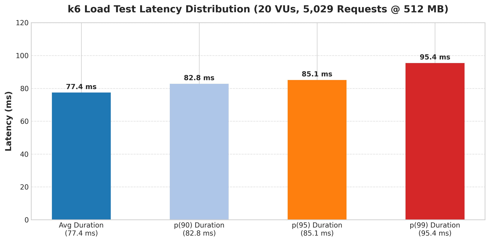

# Serverless CRUD API — Terraform, API Gateway, Lambda & DynamoDB

A production-shaped serverless microservice on AWS: **API Gateway → Lambda → DynamoDB**, fully managed and performance-tuned with Infrastructure as Code (Terraform).

---

## Architecture & API Overview


| Component | Details |
|---|---|
| **API Gateway** | REST API `DynamoDBOperations` with `POST /dynamodbmanager` resource |
| **Lambda** | Python 3.13 function with inline CRUD operations |
| **DynamoDB** | Single-table store (`crud-api-items`), partition key `id` (string), on-demand billing |
| **IAM Role** | Least-privilege role scoped to DynamoDB and CloudWatch Logs |

---

## Quick Start & Deployment

### Prerequisites
- AWS CLI configured (`aws configure`)
- Terraform `>= 1.6`
- k6 (optional, for load testing)

```bash
# 1. Initialize & Deploy Infrastructure
cd terraform
terraform init
terraform apply -auto-approve

# 2. Export API Endpoint
export API_URL=$(terraform output -raw api_invoke_url)
echo "API URL: $API_URL"
```

### Smoke Test
```bash
curl -X POST "$API_URL/dynamodbmanager" \
  -H 'Content-Type: application/json' \
  -d '{"id":"1","name":"test-item","description":"A test item"}'
```

---

## Performance & Memory Benchmarks

### 1. Lambda Power Tuning (Multi-Memory Comparison)

AWS Lambda Power Tuning was executed across 6 memory configurations to optimize execution speed vs. cost.


| Memory (MB) | Avg Duration | Cost / 1M Invocations | Optimization Summary |
|---|---|---|---|
| **128 MB** | 29.97 ms | $0.0651 | Baseline (Slower execution) |
| **256 MB** | 10.90 ms | $0.0504 | 63% faster, tied for lowest cost |
| **512 MB** | **5.33 ms** | **$0.0504** | **⭐ Optimal Choice (Fastest & Lowest Cost)** |
| **1024 MB** | 5.76 ms | $0.1176 | Diminishing returns |
| **1536 MB** | 4.90 ms | $0.1512 | Marginally faster, 3x cost |
| **3008 MB** | 5.14 ms | $0.2961 | Worst cost-efficiency |

👉 **[View Interactive Power Tuning Graph](https://lambda-power-tuning.show/#gAAAAQACAAQABsAL;wcrvQeF6LkFmrapAnTa4QP7UnEASg6RA;Gs2LM2N3WDNjd1gzSYv8M4pZIjSt9540)**

Run Power Tuning locally:
```bash
bash scripts/run-power-tuning.sh medium --report
```

---

### 2. k6 Load Test Results

Load testing with 20 Virtual Users (VUs) over 5 minutes against the tuned Lambda (512 MB).



| Memory | VUs | Total Requests | Throughput | Avg Latency | p(95) Latency | p(99) Latency | Error Rate |
|---|---|---|---|---|---|---|---|
| **512 MB** | **20** | **5,029** | **16.7 req/s** | **77.4 ms** | **85.1 ms** | **95.4 ms** | **0.00%** |

Run load test locally:
```bash
k6 run --quiet tests/load/k6-script.js --env API_URL=$API_URL
```

---

## Configuration & Cost Analysis

### Key Variables (`terraform/variables.tf`)
- `project_name`: Resource prefix (`crud-api`)
- `aws_region`: AWS region (`us-east-1`)
- `lambda_memory_size`: Configured memory size in MB (`512`)
- `log_retention_days`: CloudWatch retention (`14` days)

### Estimated Monthly Cost (1M Requests/Month)

| Component | Cost | Notes |
|---|---|---|
| **Lambda (512 MB)** | $0.00 | Covered by AWS Free Tier (400,000 GB-s) |
| **API Gateway REST** | $3.50 | $3.50 per million requests |
| **DynamoDB On-Demand** | $1.25 | Write request units |
| **CloudWatch Logs** | $0.50 | 14-day retention policy |
| **Total Estimated** | **~$5.25 / month** | |

---

## Cleanup

Tear down all AWS resources:
```bash
cd terraform
terraform destroy -auto-approve
```

